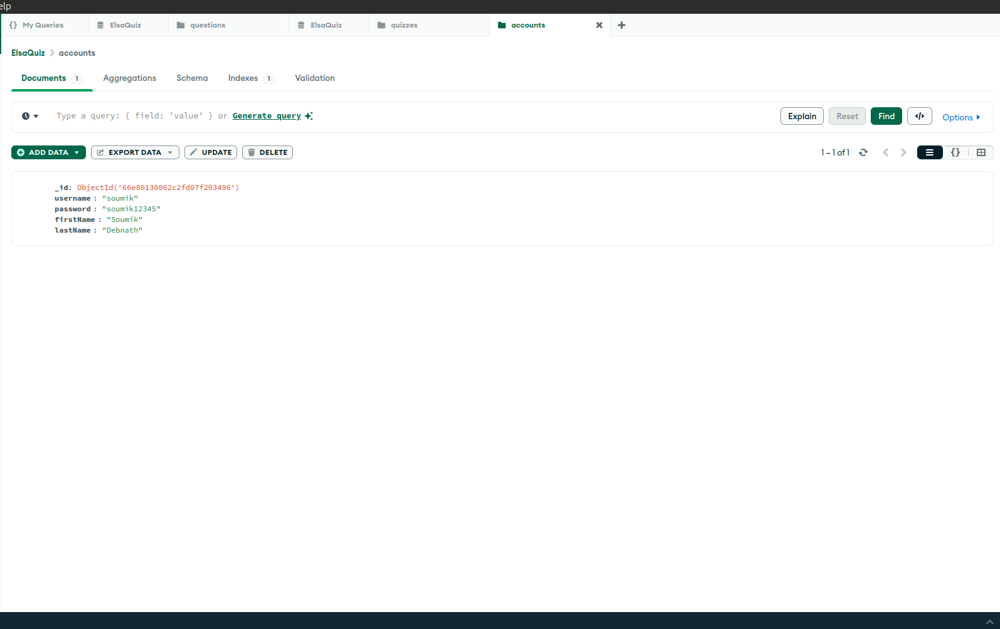

# **Elsa - Real-Time Quiz System**

**Created by**: Soumik Debnath  
**Contact**: dnsoumik.org@gmail.com

## **System Overview**

### Core Components

- **NGINX Web Server**  
  - **Chosen for**: Its high performance, reliability, and ability to handle large volumes of traffic.  
  - **Purpose**: Acts as a reverse proxy and load balancer to manage and distribute traffic between backend services.  
  - **Benefits**: Ensures scalability, efficient traffic management, and supports high concurrency.

- **Tornado (Python 3.11) - REST API**  
  - **Chosen for**: Its asynchronous capabilities and non-blocking I/O features, ideal for real-time systems.  
  - **Purpose**: Provides the backend logic and API endpoints for handling quiz submissions and real-time updates.  
  - **Benefits**: Excellent performance under heavy loads, low latency, and real-time handling of user interactions.

- **Admin Portal (Angular 17)**  
  - **Chosen for**: Its modern architecture and component-based structure, which allow for building interactive and scalable web applications.  
  - **Purpose**: Enables administrators to manage quizzes, participants, and view quiz statistics through a user-friendly interface.  
  - **Benefits**: Fast, modular, and responsive, making it ideal for managing real-time data and providing an intuitive user experience.

- **Quiz Panel (Angular 17)**  
  - **Chosen for**: Its ability to deliver a consistent, responsive user experience across devices.  
  - **Purpose**: Frontend interface for quiz participants to interact with quizzes in real-time.  
  - **Benefits**: Provides a smooth, engaging experience with real-time updates and feedback, enhancing the user’s interaction during quizzes.

- **MongoDB 7.0 - Database**  
  - **Chosen for**: Its scalability, flexibility with document-based storage, and support for fast querying in real-time environments.  
  - **Purpose**: Stores quiz data, user information, questions, and results in a flexible NoSQL format.  
  - **Benefits**: Efficient for handling large datasets, real-time updates, and rapid data retrieval.

### Technologies and Tools

- **Visual Studio Code**  
  - **Chosen for**: Its flexibility, ease of use, and comprehensive support for extensions and debugging tools.  
  - **Purpose**: Integrated development environment (IDE) used to write, debug, and manage the project codebase.  
  - **Benefits**: Lightweight, highly customizable, and supports collaboration through Git integration.

- **MongoDB Shell / Compass**  
  - **Chosen for**: Its powerful query capabilities and graphical interface for visualizing data.  
  - **Purpose**: Tools for interacting with and managing the database.  
  - **Benefits**: Simplifies database management, querying, and real-time monitoring of data.

- **AWS for Deployment**  
  - **Chosen for**: Its scalability, reliability, and global reach for hosting applications.  
  - **Purpose**: Cloud hosting platform for deploying the real-time quiz system.  
  - **Benefits**: Ensures low latency, reliability, and the ability to handle large user loads with ease.

- **Certbot for SSL**  
  - **Chosen for**: Its ease of use in obtaining and renewing SSL certificates.  
  - **Purpose**: Ensures secure communication between users and the system by encrypting data.  
  - **Benefits**: Provides free, automated SSL certificates for secure data transmission.

- **JWT for Authentication**  
  - **Chosen for**: Its simplicity and security in handling user authentication across stateless applications.  
  - **Purpose**: Secures the admin panel by validating authorized access using JSON Web Tokens.  
  - **Benefits**: Ensures only authenticated users can access sensitive admin functions, enhancing security.

## **Data Flow**

### **Implementation**

All core components have been implemented.

**Note**: Admin panel graphs use mock data due to time constraints.

## **Real-time Quiz Participation**

Anyone can participate using the following URL:
[Join Quiz](https://elsa-quiz.soumikdebnath.me/?quizId=66e88db88a1c82f8c9bdc5b6)

https://elsa-quiz.soumikdebnath.me/?quizId=66e88db88a1c82f8c9bdc5b6

## **Real-time Score Updates**

Scores can be viewed on the admin panel:
[Admin Panel](https://elsa-quiz.soumikdebnath.me/admin/auth/sign-in)

https://elsa-quiz.soumikdebnath.me/admin/auth/sign-in

### **Scalability**

Built to handle many users at once, with NGINX load balancing and asynchronous APIs.

### **Performance**

Tested with 1000 users submitting answers simultaneously.

### **Reliability**

Designed for stable performance even under time constraints.

### **Technology Components**

- **Angular 17**
- **Tornado 6.4**
- **MongoDB 7.0**

### **Working Code**

[GitHub Repo](https://github.com/dnsoumik/Real-Time-Quiz)  
https://github.com/dnsoumik/Real-Time-Quiz

## **Live Preview**

[Quiz Participation](https://elsa-quiz.soumikdebnath.me/?quizId=66e88db88a1c82f8c9bdc5b6)  
https://elsa-quiz.soumikdebnath.me/?quizId=66e88db88a1c82f8c9bdc5b6

## **Admin Panel**
- **URL** - https://elsa-quiz.soumikdebnath.me/admin/auth/sign-in
- **Username** - soumik
- **Password** - soumik12345
-
-
-
-

- **Sign In**  
  

- **Table View**  
  

- **Graph View - Mock Data**  
  

## **Quiz Portal**

## **Database Schema**

- **Tables List**  
  

- **Accounts Table**  
  

- **Questions Table**  
  

- **Quizzes Table**  
  

- **Quiz Results Table**  
  
